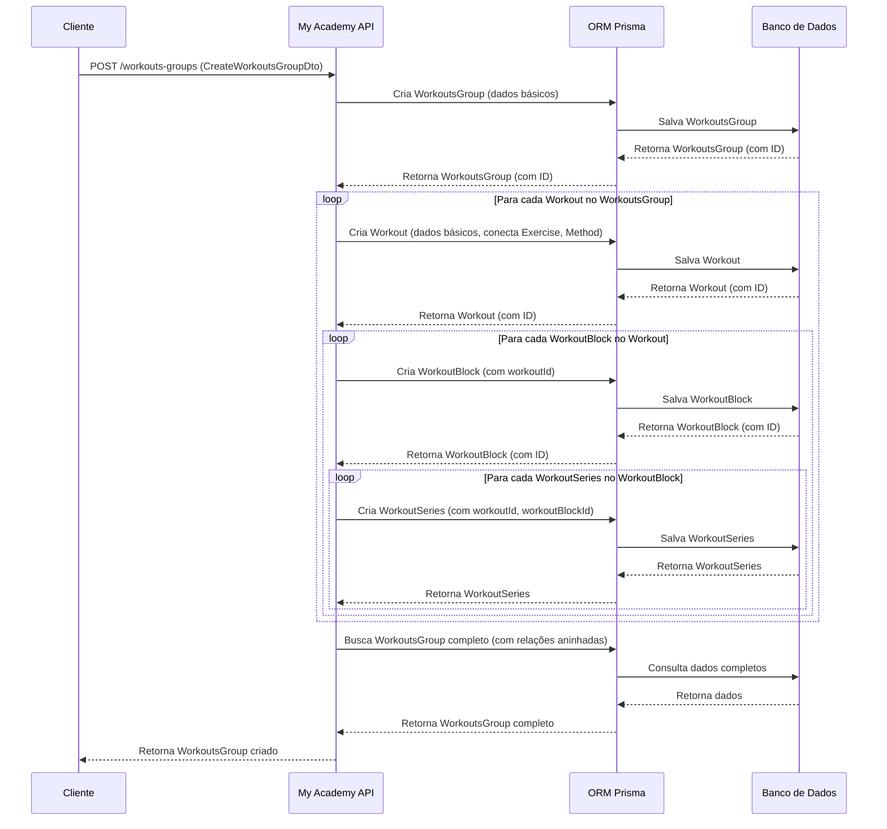

<p align="center">
  <a href="http://nestjs.com/" target="blank"></a>
</p>

  <p align="center">A progressive <a href="http://nodejs.org" target="_blank">Node.js</a> framework for building efficient and scalable server-side applications.</p>

## Visão Geral da Aplicação

My Academy API é uma API RESTful construída com NestJS que gerencia dados de academias, incluindo usuários (alunos e personais), treinos, exercícios, avaliações físicas, agendamentos de aulas e notificações. Ela suporta a criação de treinos personalizados com a capacidade de agrupar exercícios para serem realizados de forma intercalada, otimizando a experiência de treinamento.

## Diagrama de Sequência: Criação de um Grupo de Treino com Exercícios Intercalados



## Descrição

[Nest](https://github.com/nestjs/nest) framework TypeScript starter repository.

## Installation

```bash
npm install
```

## Running the app

```bash
# development
$ npm run start

# watch mode
$ npm run start:dev

# production mode
$ npm run start:prod
```

## Test

```bash
# unit tests
$ npm run test

# e2e tests
$ npm run test:e2e

# test coverage
$ npm run test:cov
```

## Support

Nest is an MIT-licensed open source project. It can grow thanks to the sponsors and support by the amazing backers. If you'd like to join them, please [read more here](https://docs.nestjs.com/support).

## Stay in touch

- Author - [Kamil Myśliwiec](https://kamilmysliwiec.com)
- Website - [https://nestjs.com](https://nestjs.com/)
- Twitter - [@nestframework](https://twitter.com/nestframework)

## License

Nest is [MIT licensed](LICENSE).

<https://app.diagrams.net/#G1s3D1kHTtljAtmFGQCpHJCDz3uvAGX5vU>
<https://rich-cyan-skunk-tutu.cyclic.app>
<https://my-academy-api.onrender.com/>

# Construir a imagem Docker

docker build -t my-academy-api .

# Executar o contêiner

docker run -p 5000:5000 my-academy-api -e "NOME_VARIAVEL=valor"

## ChatId
-1001661357785
